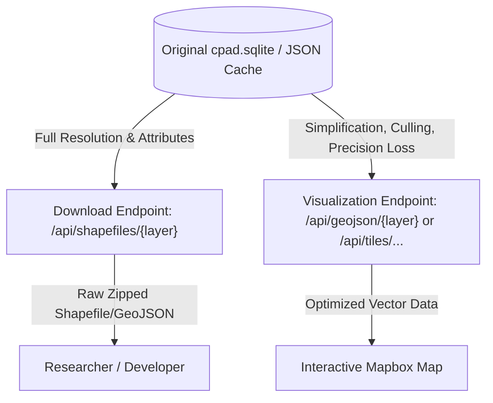

# Arctic Map — Data-Streaming Optimization Plan

Goal: demo zoom-driven LOD (decrease resolution at overview, increase detail on
zoom-in) across point / line / polygon layers, plus investigate webtiles per
the PI's suggestion.

## Current state

- `GET /api/geojson/{layer_name}` (`backend/main.py:104`) always returns an entire
  layer at full resolution. No params for detail, bbox, or zoom.
- Frontend fetches the whole layer once on checkbox toggle and feeds it to a
  Mapbox `geojson` source (`Map.jsx:361`, `Sidebar.jsx:121`, `ThematicMap.jsx:22`).
  No tile sources, no zoom-based refinement, no simplification.
- Backend cache (`backend/cache/*.json`) stores full-resolution dumps only.
- No tile infrastructure exists (no tippecanoe / mbtiles / vector tiles /
  raster tiles). `requirements.txt` has geopandas + shapely but nothing
  tile-related.
- No `cpad.sqlite` on disk in this checkout; backend falls through to the
  cached `.json` dumps. `finland_multipolygons.zip` is corrupted (HTML error
  page, not a real zip).

### Data available for the demo (in `backend/cache/`)

| File | Size | Features | Geometry type |
|---|---|---|---|
| `a_alaska_schools.json` | 92 KB | 84 | MultiPoint (point) |
| `a_clean_ne_10m_roads.json` | 805 KB | 484 | MultiLineString (line) |
| `a_clean_ne_10m_countries.json` | 5.2 MB | 9 (very dense) | MultiPolygon (polygon) |

These three cover all geometry families and a wide size range — ideal for
showing the resolution-tradeoff benefit.

## GIS file formats primer

For a detailed explanation of the geospatial file formats used in this project (including GeoJSON, Shapefiles, GeoPackages, and Vector/Raster Tiles), please refer to the [GIS File Formats Primer](file:///workspaces/global-sandbox/projects/arctic-map/gis_primer.md).

## Phase 1 — resolution-tunable GeoJSON endpoint (Approach A)

Lightweight; fits current architecture; no new dependencies.

### Backend (`main.py`)

- Add optional query params to `GET /api/geojson/{layer_name}`:
  - `?detail=low|medium|high`
  - `?bbox=minlon,minlat,maxlon,maxlat`
- On a cache hit, apply `gdf.simplify(tolerance)` where tolerance scales with
  detail (e.g. 0.001° low, 0.0001 medium, 0 high). This uses the **Douglas-Peucker algorithm** [1] implemented in **Shapely** [3]. An alternative approach is the **Visvalingam-Whyatt algorithm** [2] (often preferred for preserving shape caricatures and topology).
- Apply viewport culling with `gdf.cx[minlon:maxlon, minlat:maxlat]`. This leverages spatial indexing (e.g., **R-Tree / STRtree** [4]) to efficiently query features within the bounding box so zoomed-in views only download what is on screen.
- Cache by `(layer, detail, bbox-grid-cell)` instead of just `layer` so repeated
  zoom-ins stay fast.

### Frontend (`Map.jsx`, ~lines 355–380)

- Drive requests off the map's current zoom + bounds: a
  `zoomend`/`moveend` handler selects a `detail` tier:
  - zoom < 4  → low
  - 4–8       → medium
  - > 8       → high
- Send the current viewport as `bbox`.
- On zoom-in, swap to higher-detail fetch via
  `map.getSource(id).setData(...)` (no full layer teardown needed).
- On zoom-out, swap to coarse.
- Add a small "fetching detail..." indicator to make the LOD tradeoff explicit to
  the demo audience.

Outcome: a clean zoom-driven LOD demo across point/line/polygon, no new deps.

## Phase 2 — webtiles demo (Approach B, the PI’s direction)

### Vector tiles (for the 3 cached vector layers)

- Pre-generate `.mbtiles` from the cache GeoJSON using [**Tippecanoe**](https://github.com/felt/tippecanoe) [5], which is specifically designed to build vector tilesets from large collections of GeoJSON features while intelligently simplifying and culling features across zoom levels.
- Add a tiny FastAPI tile endpoint:
  `GET /api/tiles/{layer}/{z}/{x}/{y}.pbf` reading from the mbtiles according to the [**Mapbox Vector Tile Specification**](https://github.com/mapbox/vector-tile-spec) [6] (light dep — hand-rolled or `rio-tiler`-style handler).
- Frontend switches that layer's source to `type: "vector"` with `promoteId`,
  reusing the existing style paints.
- Mapbox handles LOD natively by zoom → the most visually striking "webtiles
  handle resolution for us" demo.

### Raster tiles (optional)

- Appropriate for true raster datasets like `topograp_e` 1km elevation
  (`thematicMapConfigs.js:10`).
- Serve as `type: "raster"` with a `{z}/{x}/{y}.png` endpoint (e.g. via
  `rio-tiler`).
- The raster is not in the current cache → flagged out of scope unless a
  GeoTIFF is produced.

## Open questions

- Clarify the garbled transcribed bit about "simulating the city-level
  dataset" / "HTML dataset" / per-field resolution — currently too ambiguous to
  action. Possibly means: (a) synthetic city-level dataset generated on the
  fly, (b) something tied to the `metadata_html` endpoint, or
  (c) per-attribute/field-level resolution toggling.
- Scope: Phase 1 only first (fast, demoable today), Phase 1 + Phase 2 vector
  tiles together, or wait for the above clarification before starting?

## Decisions recorded so far

- Detail refetch: **automatic** on zoom-in (track map zoom, refetch / reload).
- Demo datasets: the 3 layers already in `backend/cache/`.
- Tile server / tooling: no preference yet — keep it inside the existing
  FastAPI app unless a constraint emerges.

## References

1. **Douglas-Peucker Algorithm**: Douglas, D. H., & Peucker, T. K. (1973). Algorithms for the reduction of the number of points required to represent a digitized line or its caricature. *The Canadian Cartographer*, 10(2), 112–122.
2. **Visvalingam-Whyatt Algorithm**: Visvalingam, M., & Whyatt, J. D. (1993). Line generalisation by repeated elimination of points. *The Cartographic Journal*, 30(1), 46–51.
3. **Shapely Simplify Documentation**: [Shapely readthedocs - Geometric Objects `simplify`](https://shapely.readthedocs.io/en/stable/manual.html#object.simplify)
4. **STRtree Spatial Indexing**: [Shapely STRtree Documentation](https://shapely.readthedocs.io/en/stable/manual.html#strtree)
5. **Tippecanoe Tool**: [Felt Tippecanoe GitHub Repository](https://github.com/felt/tippecanoe)
6. **Mapbox Vector Tile Specification**: [Mapbox Vector Tile Spec on GitHub](https://github.com/mapbox/vector-tile-spec)
